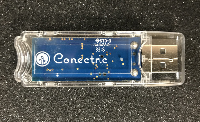

# Conectric USB Gateway Module for Node.js



## Introduction

This module is Conectric's Node.js SDK that allows you to receive data from our wireless mesh network sensors.  We aim to get you up and running quickly, so that you can rapidly build applications or visualizations that use near real time temperature, humidity, motion detection and switch state data.

## Hardware Requirements

In order to use this module, you will require:

* A computer which has a spare USB 2.0 port.
* The ability to install Node.js 8.9.4 or higher.  We recommend use of the long term stable releases.
* A USB router from Conectric.
* One or more wireless sensors from Conectric.

### USB Router

The USB router is a USB 2.0 stick that can be purchased from Conectric.  It acts as the interface between the mesh network that the sensors are connected to, and this Node module.  

### Sensors

In order to receive data via the USB router through this module, you will need at least one Conectric wireless sensor.  

The following sensor types are supported at this time:

  * Motion (PIR) sensor.
  * Switch (door switch) sensor.
  * Combined temperature / humidity sensor.

## Node.js Version

We recommend that you use [Node.js](https://nodejs.org) 8.9.4, or any subsequent long term stable (LTS) release.

## Quick Start

To get going and receive your first sensor data quickly, use one of our bundled examples:

```shell
mkdir iotgateway
cd iotgateway
npm init
```

Accept all the defaults, except "entry point", use `server.js` for that.  Then:

```shell
npm install --save conectric-usb-gateway
cp node_modules/conectric-usb-gateway/examples/logmessages/server.js .
npm start
```

Then insert batteries into your Conectric sensors, plug your Conectric USB router into a USB port on your computer and watch sensor data appear in your `console.log` output.

**Example expected output (when a temperature / humidity sensor is present):**

```shell
$ npm start

> conectric-gateway-example-logmessages@1.0.0 start /Users/conectric/projects/myiotgateway
> node server.js

Found router device at /dev/tty.usbserial-DB00VL3E.
Gateway opened.
Switched gateway to dump buffer mode.
USB router mac address is 00124b0005141c71.
{ type: 'tempHumidity',
  payload: 
   { battery: 3,
     temperature: 23.05,
     temperatureUnit: 'C',
     humidity: 41.65 },
  timestamp: 1518761945243,
  sensorId: 'a946',
  sequenceNumber: 37 }
```

`server.js` contains:

```javascript
const gateway = require('conectric-usb-gateway');

gateway.runGateway({
  onSensorMessage: (sensorMessage) => {
    console.log(sensorMessage);
  }
});
```
## Message Types

This module works by decoding sensor broadcast messages from the mesh network, then translating them into JSON objects which are then supplied to your callback function where your business logic happens.

Depending on how you configure this module (see [Configuration Options](#configuration-options) for details), and on which sensors you have available, you can expect to see the following types of message delivered to your callback. 

Each message has a set of common keys.  Others only appear when certain gateway configuration values are set in your code's call to `runGateway`:

* `payload`: (present unless `sendDecodedPayload` option is set to `false`).  Value will be an object whose schema varies depending on the value of `type`, see the next few sections for examples of each type of payload.
* `timestamp`: (always present) UNIX timestamp for when the gateway received the message from the mesh network.
* `rawData`: (present if `sendRawData` option is set to `true`).  Value will be the raw hex data for the message as received from the mesh network.  This is mostly useful for debugging this module, end users should use values from `payload`.
* `sensorId`: (always present) The last 4 characters of the mesh network MAC address of the sensor that send the message.
* `sequenceNumber`: (always present) The message sequence number -- do not rely on these to arrive in order, or be unique, as the sequence number will reset over time or if the sensor's battery is removed and replaced.  You should **not** use a combination of `sequenceNumber` and `sensorId` as a unique message key.
* `type`: (always present) indicates which type of message was received, values are:
    * `boot`
    * `motion`
    * `switch`
    * `tempHumidity`

### boot

This message is sent when a sensor initially boots up (battery is inserted), or is reset for some reason.  The message JSON looks like:

```json
{
  "type": "boot",
  "payload": {
    "battery": 2.9,
    "resetCause": "powerOn"
  },
  "timestamp": 1518746384048,
  "sensorId": "a946",
  "sequenceNumber": 0
}
```

The `payload` for the `boot` message consists of the following keys:

* `battery`: The sensor's battery level in volts.
* `resetCause`: Indicates the reason that the sensor booted, possible values are:
    * `powerOn`: The battery was inserted into the sensor.
    * `externalReset`: The sensor's reset button was pressed.
    * `watchdogReset`: The sensor's firmware detected a need to reboot the sensor.
    * `unknown`: Catch all value, which should never appear.

If your application does not need to see these messages, they can be suppressed using the `sendBootMessages` configuration option.  See the [Configuration Options](#configuration-options) for details.

### motion

This message is sent when a motion detector / PIR sensor detects motion.  The message JSON looks like:

```json
{ 
  "type": "motion",
  "payload": { 
    "battery": 2.8, 
    "motion": true 
  },
  "timestamp": 1518757698977,
  "sensorId": "02A2",
  "sequenceNumber": 12 
}
```

The `payload` for the `motion` message consists of the following keys:

* `battery`: The sensor's battery level in volts.
* `motion`: Will always be `true` as the sensor only fires when motion is detected.

### switch

This messsage is sent when a switch / door switch sensor changes state (switch / door opens or closes).  The message JSON looks like:

```json
{ 
  "type": "switch",
  "payload": { 
    "battery": 3, 
    "switch": false 
  },
  "timestamp": 1518757698977,
  "sensorId": "0219",
  "sequenceNumber": 0 
}
```

The `payload` for the `switch` message consists of the following keys:

* `battery`: The sensor's battery level in volts.
* `switch`: By default, the value will be `false` when the two switch magnets are close to each other or `true` when the two switch magnets are far apart from each other.

The optional configuration key `switchOpenValue` can be used in your call to `runGateway`.  It can be set to change the value of `switch`, so that it becomes `false` when the magnets are far apart from each other and `true` when they are close together.  To do this, set `switchOpenValue` to `false` in your call to `runGateway`:

```javascript
gateway.runGateway({
  onSensorData: (sensorData) => {
    console.log(sensorData);
  },
  switchOpenValue: false  // switch messages report true when magnets close to each other
})
```

### tempHumidity

This message is sent when a temperature and humidity sensor broadcasts the temperature and humidity values that it has observed.  The message JSON looks like:

```json
{
  "type": "tempHumidity",
  "payload": {
    "battery": 3,
    "temperature": 73.33,
    "temperatureUnit": "F",
    "humidity": 60.65
  },
  "timestamp": 1518746385455,
  "sensorId": "a946",
  "sequenceNumber": 1
}
```

The `payload` for the `tempHumidity` message consists of the following keys:

* `battery`: The sensor's battery level in volts.
* `temperature`: The temperature reading, to a maximum of two decimal places.
* `temperatureUnit`: Will be set to `"C"` if the value of `temperature` is in degrees Celcius (default), or `"F"` if the value of `temperature` is in degrees Fahrenheit.
* `humidity`: The percentage relative humidity reading, to a maximum of two decimal places.

By default, values for `temperature` will be in degrees Celcius.  To receive values in degrees Fahrenheit, set the configuration option `useFahrenheightTemps` to `true` (see [Configuration Options](#configuration-options) section).

## Callback Function

This module deals with decoding the sensor broadcast messages from the mesh network, and handles all of the heavy lifting associated with that for you.  When you start the gateway module by invoking its `runGateway` method, you must pass it a configuration object containing a callback function that will be called every time a message is received from the mesh network.  You can disable some messages (for example sensor boot messages) using the configuration settings (see [Configuration Options](#configuration-options) section) in the case where your business logic doesn't need to see them.

The object passed to the `runGateway` method must contain a key `onSensorData` whose value must be a function that takes a single parameter.  Values passed to that parameter will be JSON objects corresponding to the schemas described in [Message Types](#message-types).

Here's an example implementation that can process each type of message and display relevant data:

```javascript
const gateway = require('conectric-usb-gateway');

gateway.runGateway({
  onSensorMessage: (sensorMessage) => {
    const sensorId = sensorMessage.sensorId;
    const payload = sensorMessage.payload;

    switch (sensorMessage.type) {
      case 'boot':
        console.log(`Sensor ${sensorId} booted, reason ${payload.resetCause}`);
        break;
      case 'motion':
        console.log(`Sensor ${sensorId} detected motion.`);
        break;
      case 'tempHumidity':
        console.log(`Sensor ${sensorId} reports temp ${payload.temperature}${payload.temperatureUnit} / humidity ${payload.humidity}%.`);
        break;
      case 'switch':
        console.log(`Sensor ${sensorId}, switch state is ${payload.switch}.`);
        break;
      default:
        console.log('Unknown message type received!');
    }
  }  
});
```

## Configuration Options

The object that is passed as the only parameter to the `runGateway` method can also contain any mixture of the following additional configuration keys.  Adding additional keys that are not documented here will result in an error message from `runGateway`.

Example with some configuration options set, those which are omitted will use their default values:

```javascript
const gateway = require('conectric-usb-gateway');

gateway.runGateway({
  onSensorMessage: (sensorMessage) => {
    console.log(sensorMessage);
  },
  sendBootMessages: false, // Suppress sensor boot/reboot messages
  useFahrenheitTemps: true // Report temperature in F not C
});
```

### debugMode

Controls whether or not additional low level debugging is sent to `console.log` (informational) and `console.error` (error) from within the gateway module.

* Possible values: `true | false`
* Optional: yes
* Default: `false`

### deDuplicateBursts

Some sensors broadcast messages in a burst, where the same message ID is sent more than once to ensure that it reaches its indended recipient.  This parameter controls whether the gateway module should pass all messages having the same messsage ID to the `onSensorData` callback or only one of them.  Applies to all message types.

* Possible values: `true | false`
* Optional: yes
* Default: `true`

### sendBootMessages

Sensors broadcast boot messages when a battery is inserted or other power reset event occurs.  This parameter controls whether or not these messages are passed to the `onSensorData` callback.

* Possible values: `true | false`
* Optional: yes
* Default: `true`

### sendDecodedPayload

If `true`, messages supplied to the `onSensorData` callback will contain a `payload` key containing a JSON object that holds the decoded message payload.  The form of this object will depend on which type of message was received (see [Message Types](#message-types)).

* Possible values: `true | false`
* Optional: yes
* Default: `true`

### sendRawData

If `true`, messages supplied to the `onSensorData` callback will contain a `rawData` key containing the unencoded hex message received from the mesh network.  Mostly useful for debugging the gateway module.

* Possible values: `true | false`
* Optional: yes
* Default: `false`

### switchOpenValue

Determines whether the library reports the switch sensor having an open circuit as `true` or `false`.  Set according to your application's needs.

* Possible values: `true | false`
* Optional: yes
* Default: `false`

### useFahrenheitTemps

If `true`, messages of type `tempHumidity` will contain temperature in Fahrenheit.  If `false`, messages of type `tempHumidity` will contain temperature in Celcius.

* Possible values: `true | false`
* Optional: yes
* Default: `false`

## Getting the Gateway's MAC Address

Should you need to access the mesh network MAC address for the USB router that the gateway module is using, you can do so in your callback function as follows:

```javascript
const gateway = require('conectric-usb-gateway');

gateway.runGateway({
  onSensorMessage: (sensorMessage) => {
    console.log(gateway.macAddress); // '00124b0005141c71'
    console.log(sensorMessage);
  }
});
```

The MAC address is returned as a string.  This could for example be useful to use in a message that your callback function sends to a server, so that the originating gateway can be identified if your system has several of them.

## Bundled Examples

To get you started quickly, we have provided some basic example implementations that use the gateway module.  These are located in the `examples` folder.

### Example 1: Log Incoming Messages

**Location:** `examples/logmessages`.

**Sensors Required:** Any.

**Description:** This is the simplest example, which uses all the configuration defaults and simply logs each message received.

**Usage:** To run this example, use follow these simple steps:

```shell
mkdir iotgateway
cd iotgateway
npm init
```

Accept all the defaults, except "entry point", use `server.js` for that.  Then:

```shell
npm install --save conectric-usb-gateway
cp node_modules/conectric-usb-gateway/examples/logmessages/server.js .
npm start
```

Then insert the Conectric USB router into a free USB port, and add batteries to your sensors.

If you want to modify this example for your own purposes, simply edit `server.js` and replace the contents of the callback function with your own logic.

### Example 2: Send Incoming Messages to a Server

**Location:** `examples/sendmessages`.

**Sensors Required:** Any.

**Description:** This is a basic example showing how to receive messages from the mesh network and pass them to a server via HTTP POST to a URL.  It uses the popular [request module](https://www.npmjs.com/package/request) to manage the HTTP communications.  You can make this work simply by editing the URL to match your needs then implementing some server side logic to receive the JSON messages and do as you please with them.

**Usage:** To run this example, follow these simple steps:

```shell
mkdir iotgateway
cd iotgateway
npm init
```

Accept all the defaults, except "entry point", use `server.js` for that.  Then:

```shell
npm install --save conectric-usb-gateway
npm install --save request
cp node_modules/conectric-usb-gateway/examples/sendmessages/server.js .
npm start
```

Insert the Conectric USB stick into your computer.  After a short while you should see messages from any Conectric sensors that are nearby arriving on your computer and being sent to the server URL.

### Example 3: Send an SMS Message Via Twilio API When A Door Opens

**Location:** `examples/twiliosms`.

**Sensors Required:** Switch.

**Description:** This example uses the door (switch) sensor.  Whenever the door is opened (sensor reports `true`), the callback function uses the [Twilio SMS API](https://www.twilio.com/sms) to send a text message to a pre-determined phone number which is set via an environment variable.

In order to use this, you will need to [sign up](https://www.twilio.com/try-twilio) for a Twilio demo account, or use your own paid account if you have one.

**Usage:** Before setting up this example, you will need to get all of the following from Twilio:

* Account SID.
* Authentication Token.
* Phone Number.
* If using their trial, set up your cell phone's number as a verified number on the account.

Once you've done that, set some environment variables on your local machine:

* `TWILIO_ACCOUNT_SID`, set to your Twilio Account SID.
* `TWILIO_AUTH_TOKEN`, set to your Twilio Authentication Token.
* `TWILIO_PHONE_NUMBER`, set to your Twilio Account's phone number (the one that SMS messages will appear to have come from).
* `TWILIO_DESTINATION_PHONE_NUMBER`, set to the phone number you wish to send the SMS messages to (for trial accounts this must be a verified phone number with Twilio).

Once the environment variables have been set, follow these steps to install dependencies and set up npm:

```shell
mkdir iotgateway
cd iotgateway
npm init
```

Accept all the defaults, except "entry point", use `server.js` for that.  Then:

```shell
npm install --save conectric-usb-gateway
npm install --save twilio
cp node_modules/conectric-usb-gateway/examples/twiliosms/server.js .
npm start
```

Insert the Conectric USB stick into your computer and turn on any door sensors.  Once you open the door sensor (magnets apart) you should expect to see an SMS API call to Twilio which should trigger a text message to the phone whose number is set in `TWILIO_DESTINATION_PHONE_NUMBER`.

### Example 4: Post Motion Events to a Slack Channel At A Configurable Minimum Interval

**Location:** `examples/slackmotion`.

**Sensors Required:** Motion.

**Description:** This example receives messages from motion sensors, and will report motion events to the popular collaboration / chat platform [Slack](https://slack.com) after a configurable minimum time interval has passed since the last event.

**Usage:** Before starting up this example, you will need to get an incoming webhook URL from Slack for the Slack team that you wish to use.  See the [Slack API documentation](https://api.slack.com/incoming-webhooks) for details of how to do so.

Once you have obtained your Slack webhook URL, go ahead and set the following environment variables on your local machine:

* `SLACK_WEBHOOK_URL`, set to the full URL that you got from Slack.
* `MOTION_REPORTING_CHANNEL`, set to the name of the Slack channel that you'd like messages posted to e.g. `random`.  You don't need the leading `#` in the channel name here.
* `MOTION_REPORTING_INTERVAL`, set the to minumum number of seconds that you'd like to have elapsed between motion events being sent to Slack e.g. `60` = 1 minute.

Having set the environment variables, follow these steps to install dependencies and set up npm:

```shell
mkdir iotgateway
cd iotgateway
npm init
```

Accept all the defaults, except "entry point", use `server.js` for that.  Then:

```shell
npm install --save conectric-usb-gateway
npm install --save slack-node
cp node_modules/conectric-usb-gateway/examples/slackmotion/server.js .
npm start
```

Insert the Conectric USB stick into your computer then insert the batteries into your motion sensor(s).  Trigger a motion sensor by waving at it, which should cause a motion event to be reported in your Slack channel.  Subsequent messages will be sent to Slack when motion is detected if `TEMPERATURE_REPORTING_INTERVAL` seconds or more have passed since the last motion event was seen.

### Example 5: Post Temperature Data to Elasticsearch

**Location:** `examples/elastic`.

**Sensors Required:** Temperature.

**Description:** This example receives messages from the mesh network, and reformats temperature/humidity sensor messages to flat JSON objects that it then sends to [Elasticsearch](https://www.elastic.co/products/elasticsearch).  Objects are placed into an index called `temphumidityreadings` which is created for you if not found.

In order to use this, you will need to download and setup Elasticsearch, or use their [cloud hosted solution](https://www.elastic.co/cloud/as-a-service).  You could also use additional tools such as [Grafana](https://grafana.com/) to visualize the data.  Grafana is also available to download, or as a cloud hosted service.

**Usage:** Before starting up this example, you will need to:

* Install Elasticsearch somewhere (locally, on a server, or use the hosted cloud trial).
* Know the URL and port that your Elasticsearch is running on.
* Know your Elasticsearch user name (often `elastic`) and password.

Once you have all of these things, set some environment variables on your local machine:

* `ELASTICSEARCH_URL`, set to the Elasticsearch URL minus the port information.  Must begin `http://` or `https://` e.g. `https://elasticsearch.mydomain.com`.
* `ELASTICSEARCH_USER`, set to the Elasticsearch user's username e.g. `elastic`.
* `ELASTICSEARCH_PASSWORD`, set to the Elasticsearch user's password.
* `ELASTICSEARCH_PORT`, set to the port that Elasticsearch is running on e.g. `9243`.

Once the environment variables have been set, follow these steps to install dependencies and set up npm:

```shell
mkdir iotgateway
cd iotgateway
npm init
```

Accept all the defaults, except "entry point", use `server.js` for that.  Then:

```shell
npm install --save conectric-usb-gateway
npm install --save elasticsearch
cp node_modules/conectric-usb-gateway/examples/elastic/server.js .
npm start
```

Insert the Conectric USB stick into your computer.  After a short while you should see temperature and humidity readings appear in Elasticsearch from any Conectric temperature sensors that you have nearby.

## Power Management Tips

If your application requires continuous data gathering, you should ensure that the various power saving options on the computer that you plug the USB stick into are disabled.  Otherwise, you may find that the computer may sleep the USB ports, causing a gap in your data collection.

## Usage on Raspberry Pi

When using this module on a Raspberry Pi running the Raspbian operating system, we recommend using Raspbian Stretch Lite.  Installation on Raspbian (Desktop or Lite edition) will require some additional steps to install a more up to date version of Node and additional packages required to enable USB support in Node.

### Install Node.js

```shell
curl -sL https://deb.nodesource.com/setup_9.x | sudo -E bash -
sudo apt-get install -y nodejs
```

Check that Node was correctly installed:

```shell
npm --version
node --version
```

### Install Required Packages for USB

Additional packages need to be installed to add USB support:

```shell
sudo apt-get install libusb-1.0-0-dev
sudo apt-get install libudev-dev
```

## Licensing

This project is licensed under the terms of the [MIT license](https://opensource.org/licenses/MIT).
